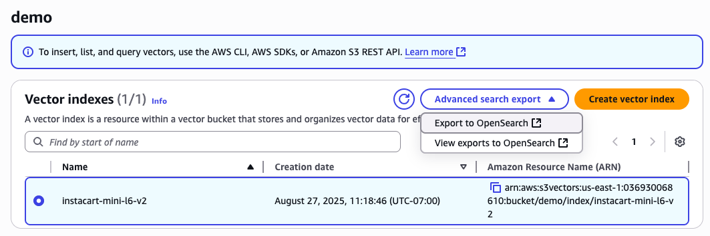
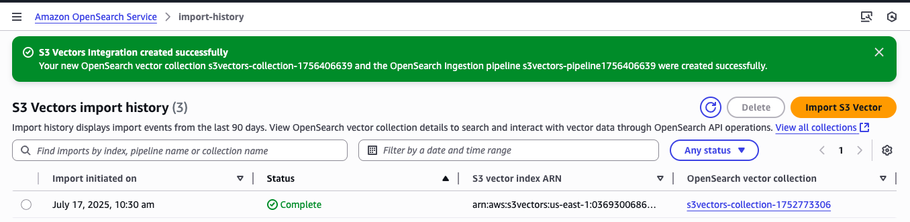

# S3 Vectors Demo with Sentence Transformers

This demo showcases how to use AWS S3 Vectors with Sentence Transformers embeddings for semantic search on product data. It demonstrates the complete pipeline from embedding generation to vector search using the `all-MiniLM-L6-v2` model.

## Overview

The demo processes Instacart product data through the following pipeline:
1. **Generate embeddings** using Sentence Transformers (`all-MiniLM-L6-v2`)
2. **Upload vectors** to AWS S3 Vectors service
3. **Search and compare** results between S3 Vectors and OpenSearch

## Model Information

- **Model**: [sentence-transformers/all-MiniLM-L6-v2](https://huggingface.co/sentence-transformers/all-MiniLM-L6-v2)
- **Dimensions**: 384
- **Use Case**: Semantic similarity and search
- **Performance**: Fast inference, good quality embeddings

## Prerequisites

1. **AWS Credentials**: Configure AWS CLI or environment variables
2. **Python Environment**: Python 3.8+ with virtual environment
3. **Dependencies**: Install from `requirements.txt`

```bash
pip install -r requirements.txt
```

## Quick Start

### 1. Generate Embeddings

The `generate_embeddings.py` script loads the Sentence Transformer model, processes product data in batches, creates embeddings with metadata, and saves progress for resumable processing.

**Configuration variables** (top of file):
```python
INPUT_FILE = "instacart_sample_data.jsonl"
OUTPUT_DIR = "sentence_transformer_embeddings"
MODEL_NAME = "sentence-transformers/all-MiniLM-L6-v2"
BATCH_SIZE = 200
```

```bash
cd s3_vectors/data
python generate_embeddings.py
```

### 2. Upload to S3 Vectors

The `s3_vectors_ingestion.py` script provides interactive S3 Vector bucket/index selection, batch upload with progress tracking, resume capability, and comprehensive timing metrics.

**Configuration variables** (top of file):
```python
S3_VECTOR_BUCKET_NAME = "BUCKETNAME"  # Change to your s3 bucket name 
S3_VECTOR_INDEX_NAME = "INDEXNAME"  # Change to your index name
EMBEDDINGS_DIR = "sentence_transformer_embeddings"
REGION_NAME = "us-east-1"
BATCH_SIZE = 500
```

```bash
python s3_vectors_ingestion.py
```

Interactive setup will guide you through:
- Selecting or creating S3 Vector buckets
- Selecting or creating vector indexes
- Uploading all embeddings with progress tracking

### 3. Export to OpenSearch (Required for Comparison)

Before running the comparison app, export your S3 Vector index to OpenSearch Serverless using the AWS Console's one-click export feature.

#### Steps:
1. **Navigate to S3**: Go to the AWS S3 service in the AWS Console, then select "Vector buckets" on the side navigation
2. **Select Your Vector Bucket**: Choose the bucket containing your embeddings (e.g., "your-vector-bucket-name")
3. **Select Your Index**: Choose the index you created (e.g., "your-vector-index-name")
4. **Click Export to OpenSearch**: Use the one-click export feature



5. **Configure Export Settings**: 
   - Configure the target collection and index name
   - Click "Export" to start the process

6. **Wait for Completion**: Monitor the export status until it shows "Complete" (estimated 15 minutes for this dataset)



7. **Find the Index Name**: 
   - Go to your OpenSearch Serverless collection in the AWS Console
   - Click on the "OpenSearch Dashboard" link 
   - Click "Interact with the OpenSearch API"
   - Use the default query: `GET _cat/indices`
   - Click the play button to execute
   - Note down the index name from the response
   - This index name will be used in the Streamlit configuration

8. **Configure Data Access Policy**:
   - In the OpenSearch Serverless collection page, scroll to the bottom
   - Click on the associated "Data access policy" 
   - Click "Edit"
   - Click "Add principal"
   - Select the IAM role that your CLI/application will use
      - If you are using the CLI, use 'aws sts get-caller-identity' to find the ARN
   - Save the policy changes
   - This allows your application to query the OpenSearch index
   - Allow a few minutes for it to update


### 4. Configure and Run Comparison App

After the export completes, update the Streamlit app configuration variables at the top of `s3_vectors/opensearch_comparison/streamlit_search_comparison.py`:

```python
# S3 Vectors Configuration (from your upload)
S3_VECTOR_BUCKET_NAME = "your-vector-bucket-name"  # Change to your s3 bucket name 
S3_VECTOR_INDEX_NAME = "your-vector-index-name"  # Change to your index name
S3_VECTOR_REGION = "us-east-1"

# OpenSearch Configuration (from the export process)
OPENSEARCH_HOST = "your-opensearch-host.us-east-1.aoss.amazonaws.com"  # Update this
OPENSEARCH_INDEX_NAME = "your-opensearch-index-name"  # Update this
OPENSEARCH_REGION = "us-east-1"

# Model Configuration
MODEL_NAME = "sentence-transformers/all-MiniLM-L6-v2"
```

**Finding OpenSearch Details:**
- **OpenSearch Host**: Found in the OpenSearch Serverless console under your collection
- **Index Name**: The index name you specified during the export process
- **Region**: Should match your S3 Vectors region

```bash
cd ../opensearch_comparison
streamlit run streamlit_search_comparison.py
```


## File Structure

```
s3_vectors/
├── README.md                           # This file
├── requirements.txt                    # Python dependencies
├── data/
│   ├── generate_embeddings.py         # Embedding generation script
│   ├── s3_vectors_ingestion.py        # S3 Vectors upload script
│   ├── instacart_sample_data.jsonl    # Sample product data
│   └── sentence_transformer_embeddings/
│       ├── embeddings.jsonl           # Generated embeddings
│       ├── progress.json              # Generation progress
│       └── upload_progress.json       # Upload progress
└── opensearch_comparison/
    └── streamlit_search_comparison.py  # Search comparison app
```

## Key Features

### Resumable Processing
- Both embedding generation and upload support resume functionality
- Progress is saved automatically and can be resumed after interruption
- Graceful handling of Ctrl+C interruptions

### Interactive Setup
- User-friendly prompts for bucket and index selection
- Option to create new resources or use existing ones
- Clear validation and error messages

### Performance Monitoring
- Real-time progress bars with detailed metrics
- Comprehensive timing information
- Upload rate calculations and summaries

### Error Handling
- Robust error handling with detailed logging
- Automatic retry logic for transient failures
- Clear error messages and troubleshooting guidance

## Troubleshooting

### Common Issues

1. **AWS Credentials**: Ensure AWS credentials are properly configured
2. **Permissions**: Verify S3 Vectors and OpenSearch Serverless permissions in your AWS account
3. **Region**: Make sure you're using a region that supports both S3 Vectors and OpenSearch Serverless
4. **Dependencies**: Install all required packages from `requirements.txt`

### Export-Related Issues

1. **Export Stuck**: If the export process appears stuck, check the AWS CloudWatch logs for the export job
2. **Permission Errors**: Ensure your AWS role has permissions for both S3 Vectors and OpenSearch Serverless
3. **Index Not Found**: Verify the exported index name matches what you configured in the Streamlit app
4. **Connection Errors**: Check that the OpenSearch host URL is correct and accessible

### Export Prerequisites

Before starting the export process, ensure:
- Your S3 Vector index is fully created and populated
- You have an OpenSearch Serverless collection ready (or permissions to create one)
- Your AWS account has the necessary service-linked roles for the export process

### Resume Interrupted Uploads

If an upload is interrupted, simply run the script again:
```bash
python s3_vectors_ingestion.py
```

The script will detect existing progress and offer to resume from where it left off.

## Next Steps

1. **Customize Configuration**: Modify the configuration variables at the top of each script
2. **Try Different Models**: Experiment with other Sentence Transformer models
3. **Scale Up**: Test with larger datasets
4. **Integrate Search**: Use the Streamlit app to test search functionality
5. **Production Deployment**: Adapt scripts for your production environment

